# Ranger AI Vault — System Architecture

> Complete technical architecture documentation with visual diagrams for every subsystem.

---

## Table of Contents

- [System Overview](#1-system-overview)
- [Vault Architecture](#2-vault-architecture)
- [Signal Engine Pipeline](#3-signal-engine-pipeline)
- [Keeper Bot Architecture](#4-keeper-bot-architecture)
- [Data Flow](#5-data-flow)
- [Risk Framework](#6-risk-framework)
- [Ed25519 Attestation Flow](#7-ed25519-attestation-flow)
- [Rebalance Engine Loops](#8-rebalance-engine-loops)
- [Trade Execution Flow](#9-trade-execution-flow)
- [Dashboard Architecture](#10-dashboard-architecture)
- [Deployment Architecture](#11-deployment-architecture)
- [Network & Protocol Interactions](#12-network--protocol-interactions)
- [State Machine](#13-state-machine)
- [Security Model](#14-security-model)
- [Package Dependency Graph](#15-package-dependency-graph)
- [Database & Storage](#16-database--storage)
- [Failure Modes & Recovery](#17-failure-modes--recovery)
- [Sequence Diagrams](#18-sequence-diagrams)

---

## 1. System Overview

The complete system spanning on-chain programs, off-chain services, external APIs, and the user-facing dashboard.

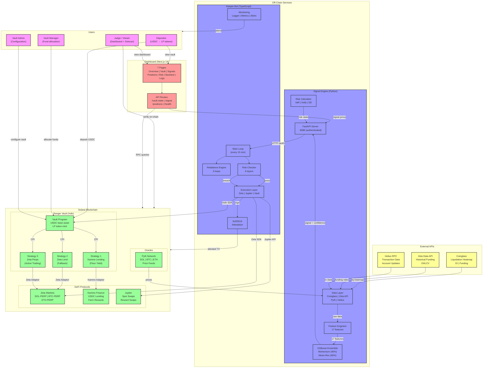

---

## 2. Vault Architecture

The on-chain vault structure showing the Voltr SDK integration, adaptor pattern, and role-based access control.

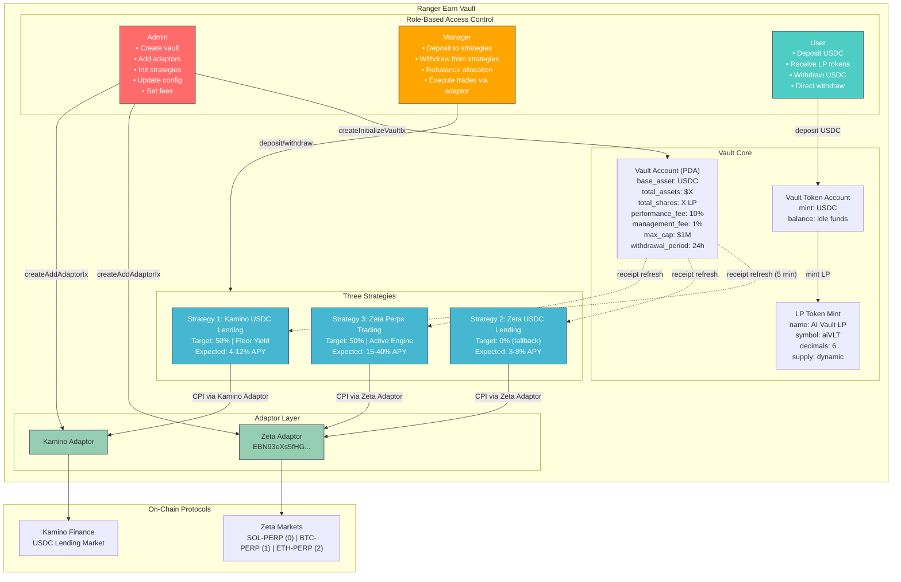

---

## 3. Signal Engine Pipeline

The complete ML pipeline from raw data ingestion to signal output.

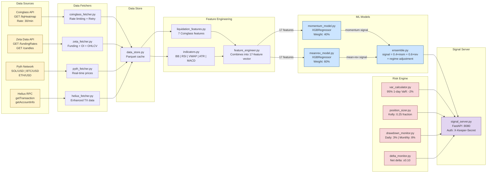

---

## 4. Keeper Bot Architecture

Internal architecture of the keeper bot showing all modules and their interactions.

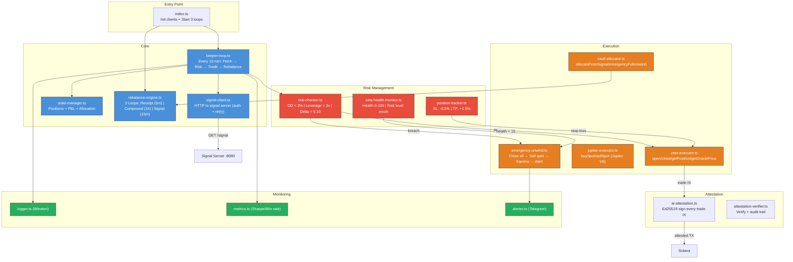

---

## 5. Data Flow

End-to-end data flow showing how information moves through the entire system every 15 minutes.

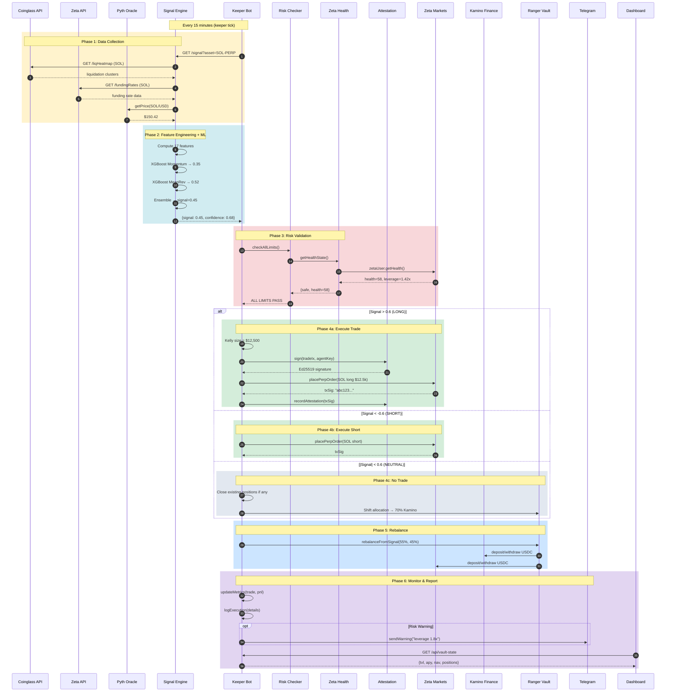

---

## 6. Risk Framework

The 6-layer risk management architecture.

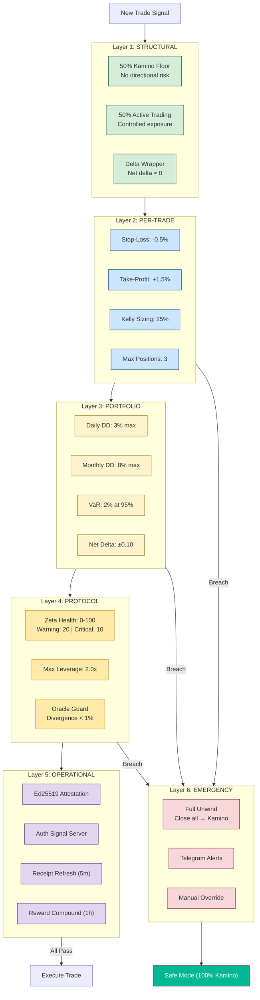

---

## 7. Ed25519 Attestation Flow

Detailed flow of how every trade is cryptographically attested.

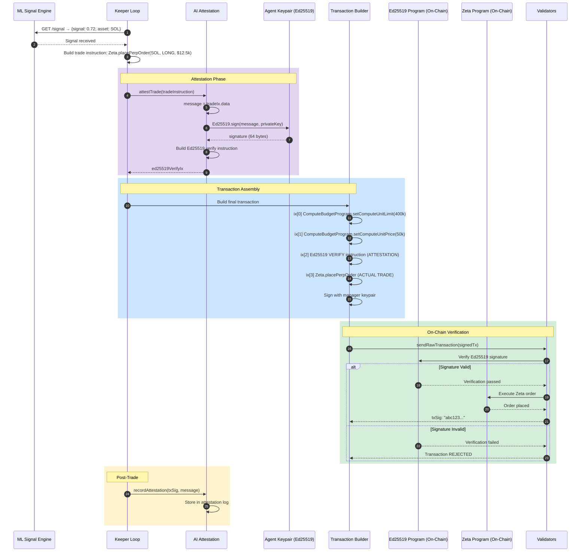

---

## 8. Rebalance Engine Loops

The three independent loops running in the keeper.

```mermaid
graph TB
 subgraph Loop1[" Loop 1: Receipt Refresh (every 5 min)"]
 R1["Timer triggers"] --> R2["For each strategy"]
 R2 --> R3["createRefreshReceiptIx()"]
 R3 --> R4["sendOptimisedTx()"]
 R4 --> R5["NAV per LP = accurate"]
 R5 -.->|"5 min later"| R1
 end

 subgraph Loop2[" Loop 2: Reward Compound (every 1 hour)"]
 C1["Timer triggers"] --> C2["Claim Kamino rewards"]
 C2 --> C3{"Balance > 0?"}
 C3 -->|"Yes"| C4["Swap → USDC via Jupiter"]
 C3 -->|"No"| C5["Check idle USDC"]
 C4 --> C5
 C5 --> C6{"Idle > $1?"}
 C6 -->|"Yes"| C7["Re-deposit to Kamino"]
 C6 -->|"No"| C8["Done"]
 C7 --> C8
 C8 -.->|"1 hour later"| C1
 end

 subgraph Loop3[" Loop 3: Signal Rebalance (every 15 min)"]
 S1["Timer triggers"] --> S2["Fetch signal"]
 S2 --> S3["Compute target allocation"]
 S3 --> S4["Get current on-chain"]
 S4 --> S5{"Delta > $10?"}
 S5 -->|"Yes"| S6["Withdraw over-allocated"]
 S5 -->|"No"| S7["Log"]
 S6 --> S8["Deposit under-allocated"]
 S8 --> S7
 S7 -.->|"15 min later"| S1
 end

 subgraph Allocation[" Dynamic Allocation"]
 A1["No signal (0.0): 80% Kamino / 20% Zeta"]
 A2["Weak (0.3): 68% Kamino / 32% Zeta"]
 A3["Strong (0.6+): 52% Kamino / 48% Zeta"]
 A4["Max (1.0): 40% Kamino / 60% Zeta"]
 end

 classDef refresh fill:#d4edda,stroke:#155724
 classDef compound fill:#fff3cd,stroke:#856404
 classDef rebalance fill:#cce5ff,stroke:#004085
 classDef alloc fill:#e2d5f1,stroke:#5a2d82

 class R1,R2,R3,R4,R5 refresh
 class C1,C2,C3,C4,C5,C6,C7,C8 compound
 class S1,S2,S3,S4,S5,S6,S7,S8 rebalance
 class A1,A2,A3,A4 alloc
```

---

## 9. Trade Execution Flow

Complete flow from signal to on-chain trade execution.

```mermaid
flowchart TD
 Start(["⏰ Keeper Tick (every 15 min)"]) --> FetchSignals

 subgraph FetchPhase["Phase 1: Signal Collection"]
 FetchSignals["Fetch signals for SOL, BTC, ETH"]
 FetchSignals --> SignalSOL["SOL: +0.72"]
 FetchSignals --> SignalBTC["BTC: -0.31"]
 FetchSignals --> SignalETH["ETH: +0.08"]
 end

 subgraph RiskPhase["Phase 2: Risk Validation"]
 SignalSOL --> RiskCheck{"Risk Check (6 layers)"}
 SignalBTC --> RiskCheck
 SignalETH --> RiskCheck
 RiskCheck --> DD{"Daily DD < 3%?"}
 DD -->|""| Health{"Zeta Health > 15?"}
 DD -->|""| Emergency[" EMERGENCY UNWIND"]
 Health -->|""| Delta{"Net Delta < 0.10?"}
 Health -->|""| Emergency
 Delta -->|""| Positions{"Open Pos < 3?"}
 Delta -->|""| Rehedge["Rebalance delta"]
 Positions -->|""| CheckSL["Check SL/TP"]
 Positions -->|""| SkipNew["Skip new trades"]
 end

 subgraph TradePhase["Phase 3: Execute"]
 CheckSL --> NewTrades{"Signal > 0.6?"}
 NewTrades -->|"SOL: 0.72"| SizeTrade["Kelly: $12,500"]
 NewTrades -->|"BTC: 0.31"| NoTrade["No trade"]
 SizeTrade --> Attest["Ed25519 sign"]
 Attest --> SendTx["sendOptimisedTx()"]
 SendTx --> Confirm{"Confirmed?"}
 Confirm -->|""| Record["Record in state"]
 Confirm -->|""| SendTx
 end

 subgraph RebalancePhase["Phase 4: Rebalance"]
 Record --> Rebalance["Compute target allocation"]
 NoTrade --> Rebalance
 SkipNew --> Rebalance
 Rehedge --> Rebalance
 Rebalance --> UpdateMetrics["Update P&L, Sharpe, DD"]
 end

 UpdateMetrics --> End(["⏰ Wait 15 min"])
 Emergency --> SafeMode["100% Kamino"] --> End

 classDef emergency fill:#d63031,stroke:#333,color:#fff
 class Emergency,SafeMode emergency
```

---

## 10. Dashboard Architecture

Frontend architecture and data flow.

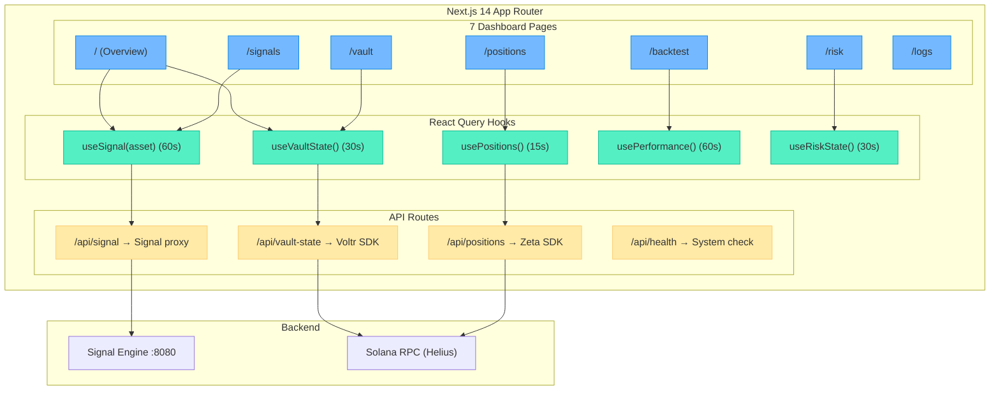

---

## 11. Deployment Architecture

Production deployment with Docker Compose.

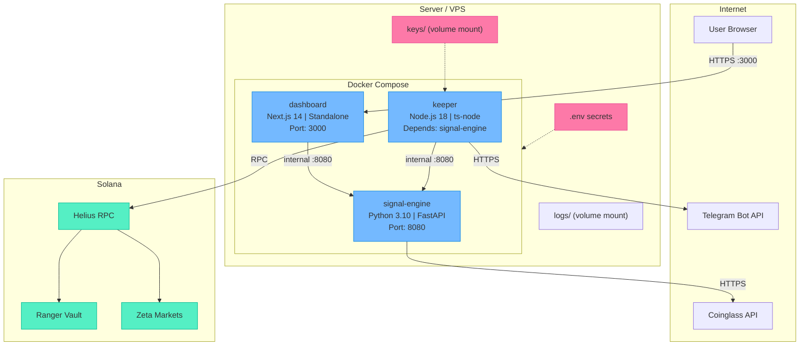

---

## 12. Network & Protocol Interactions

All external API calls and RPC interactions.

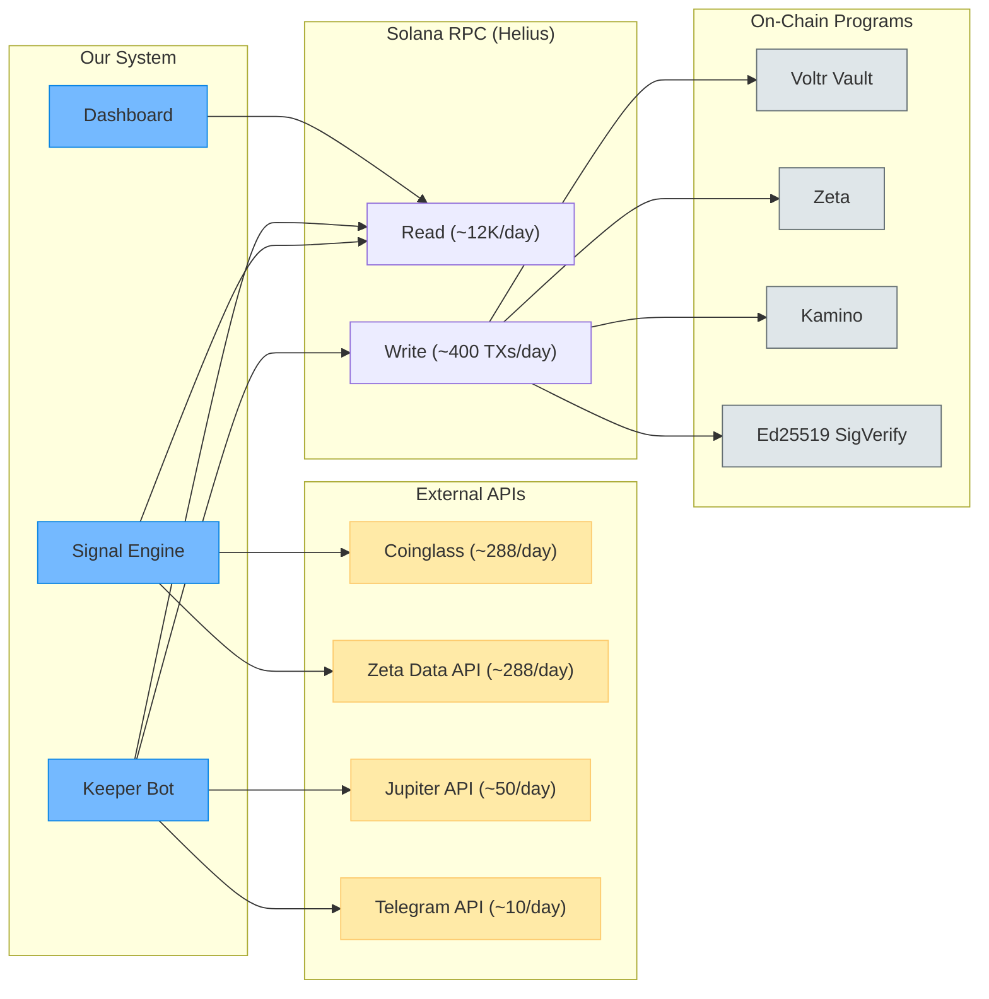

---

## 13. State Machine

The vault operating states and transitions.

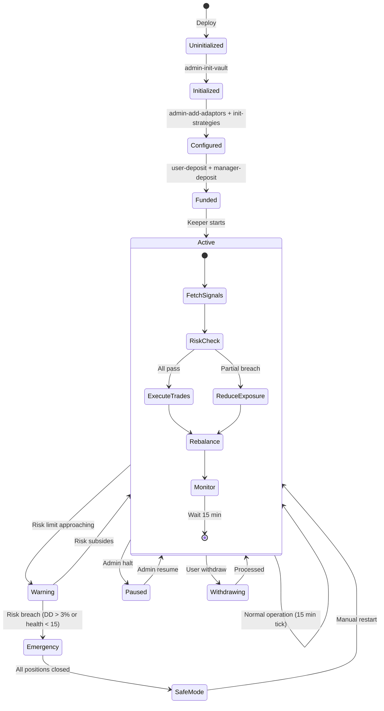

---

## 14. Security Model

Authentication, authorization, and key management.

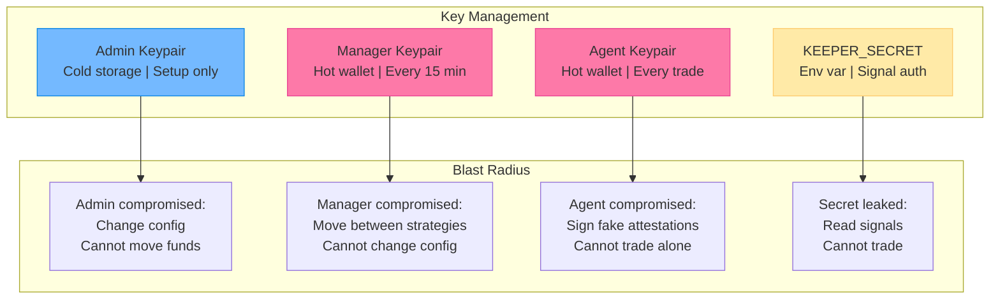

---

## 15. Package Dependency Graph

How the 4 packages depend on each other.

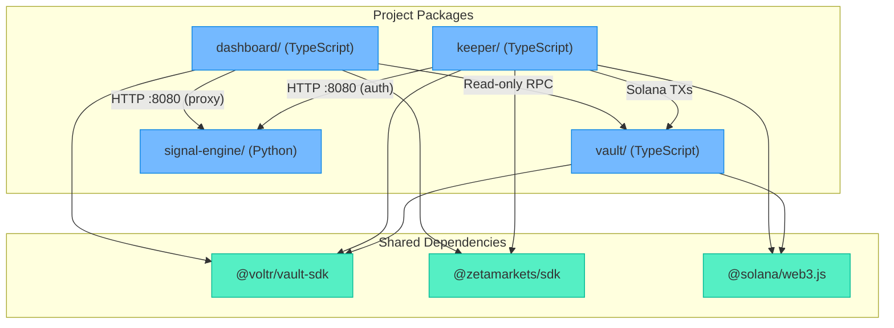

---

## 16. Database & Storage

Where data persists across the system.

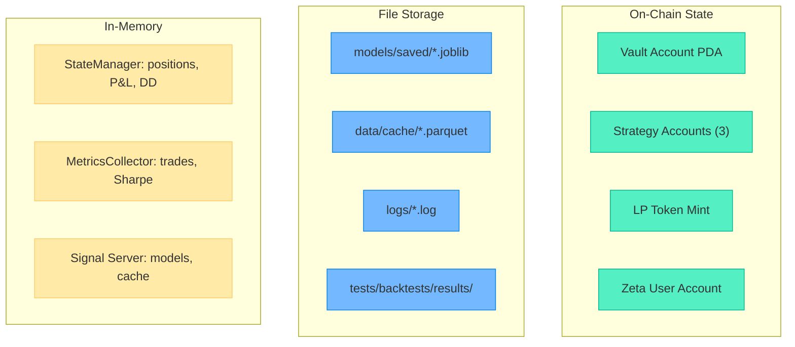

---

## 17. Failure Modes & Recovery

How the system handles failures at each level.

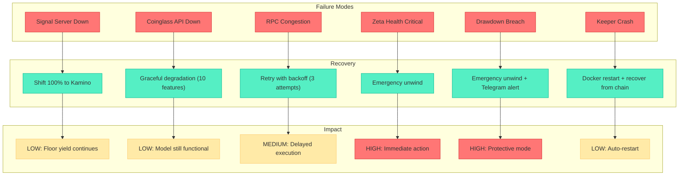

---

## 18. Sequence Diagrams

### 18.1 User Deposit Flow

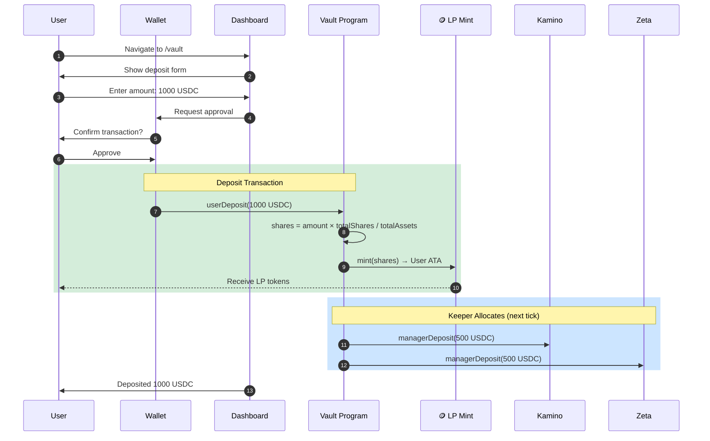

### 18.2 Emergency Unwind Sequence

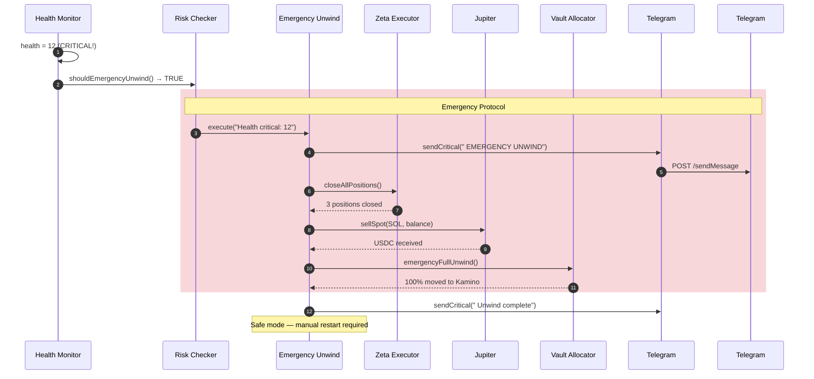

### 18.3 Full Keeper Tick Sequence

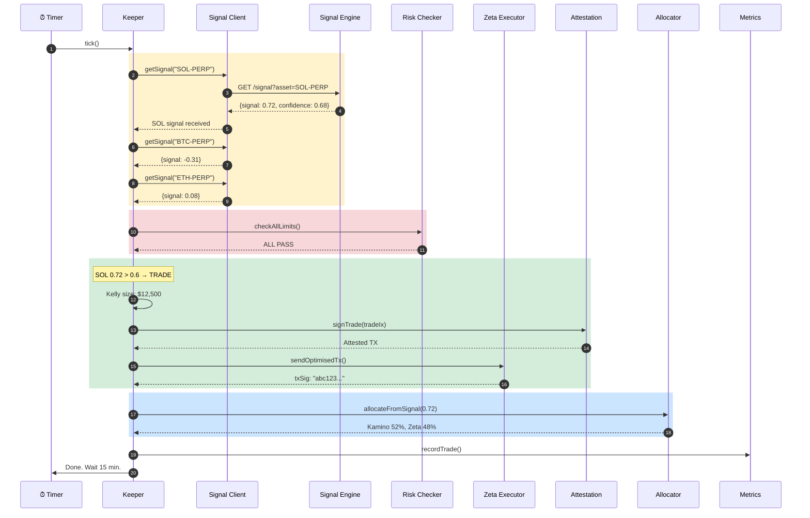

---

## Appendix: Key Addresses

| Item | Address |
|------|---------|
| Zeta Adaptor | `EBN93eXs5fHGBABuajQqdsKRkCgaqtJa8vEFD6vKXiP` |
| USDC Mint | `EPjFWdd5AufqSSqeM2qN1xzybapC8G4wEGGkZwyTDt1v` |
| Wrapped SOL | `So11111111111111111111111111111111111111112` |
| Ed25519 Program | `Ed25519SigVerify111111111111111111111111111` |
| Vault Address | `[DEPLOY_OUTPUT]` |

| Market | Zeta Index |
|--------|------------|
| SOL-PERP | 0 |
| BTC-PERP | 1 |
| ETH-PERP | 2 |

| API | Endpoint |
|-----|----------|
| Zeta Data | `data.api.zeta.markets` |
| Coinglass | `open-api.coinglass.com` |
| Jupiter | `quote-api.jup.ag/v6` |
| Helius | `mainnet.helius-rpc.com` |

---

> This architecture document is part of the Ranger AI Vault submission for the Build-A-Bear Hackathon. All diagrams render in GitHub Markdown, VS Code (with Mermaid extension), and any Mermaid-compatible viewer.
