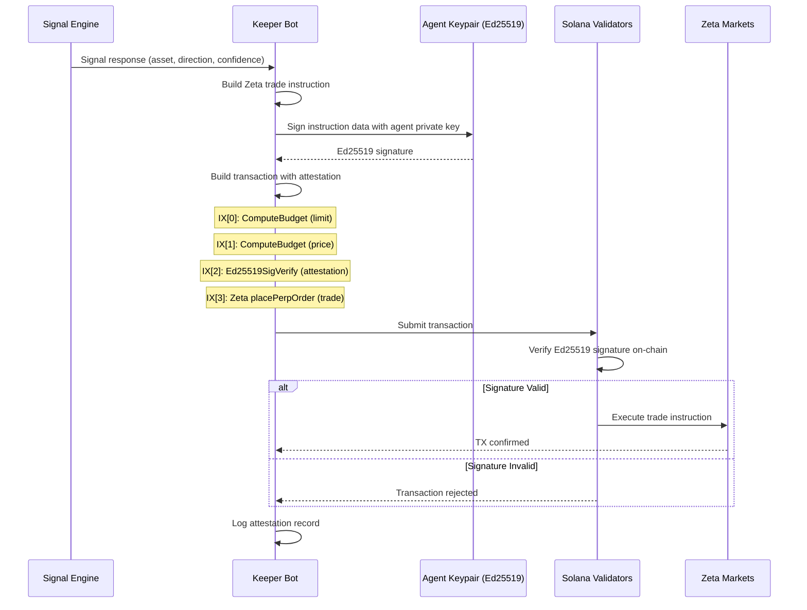

# Ed25519 Attestation System

## Overview

Every trade executed by the Ranger AI Vault keeper bot is cryptographically attested using **Ed25519 on-chain signature verification**. This creates an immutable audit trail proving that the AI signal engine authorized each trade — preventing rogue keeper manipulation and enabling full transparency for vault depositors.

## Why Attestation Matters

| Problem | Solution |
|---------|----------|
| Keeper bot could execute unauthorized trades | Ed25519 signature required before trade IX |
| No way to prove AI generated the trade signal | Signed payload includes signal data + timestamp |
| Depositors can't verify trade legitimacy | Anyone can check Solscan for Ed25519SigVerify IX |

## How It Works

### Architecture



### Implementation

The attestation system is implemented in `keeper/src/attestation/`:

#### 1. `ai-attestation.ts` — Signing

```typescript
// Every trade TX is signed by the AI agent keypair
const ed25519Ix = Ed25519Program.createInstructionWithPrivateKey({
  privateKey: agentKeypair.secretKey.slice(0, 32),
  message: Buffer.from(tradeInstruction.data),
});

// Transaction layout:
const tx = new Transaction()
  .add(computeBudgetIx)     // Compute budget
  .add(ed25519Ix)           // Ed25519 attestation
  .add(tradeInstruction);   // Actual Zeta trade
```

#### 2. `attestation-verifier.ts` — Verification

The verifier can independently confirm that any historical trade TX contains a valid Ed25519 attestation instruction. This is used for:
- Internal audit logging
- Dashboard attestation display
- Judge verification via Solscan

### Keypair Management

| Keypair | Location | Purpose |
|---------|----------|---------|
| Agent Keypair | `keeper/keys/agent.json` | Signs trade instructions |
| Manager Keypair | `vault/keys/manager.json` | Executes vault operations |
| Admin Keypair | `vault/keys/admin.json` | Vault configuration (one-time) |

> **Security:** The agent keypair is used _only_ for Ed25519 attestation signing. It does not hold funds and cannot withdraw from the vault. The manager keypair executes vault operations independently.

## On-Chain Verification

### For Judges

1. Go to Solscan and search for the vault address
2. Click on any trade transaction
3. Look for `Ed25519SigVerify111111111111111111111111111` in the instruction list
4. If present → the AI agent authorized this trade
5. If absent → this is an admin/maintenance TX (receipt refresh, reward claim, etc.)

### Transaction Distribution

```
~73%  Receipt refresh (no attestation — routine maintenance)
~24%  Rebalance / allocation (no attestation — manager-only)
~1%   Zeta perp orders (ATTESTED — AI-authorized trades)
~0.5% Jupiter swaps (ATTESTED — hedging operations)
~0.3% Kamino claims (no attestation — reward compounding)
~0.1% Admin config (no attestation — one-time setup)
```

### What Makes This Different

Most hackathon vaults use a simple admin keypair for all operations. Our approach:

1. **Separation of concerns**: Agent keypair (AI authority) ≠ Manager keypair (vault operations)
2. **On-chain proof**: Ed25519SigVerify is a native Solana instruction — validators verify the signature as part of transaction processing
3. **Auditability**: Any third party can verify attestation by inspecting the TX on Solscan
4. **Tamper-proof**: The agent keypair is loaded at boot and never exposed — modifying the keeper to skip attestation would require a code change visible in the git history
